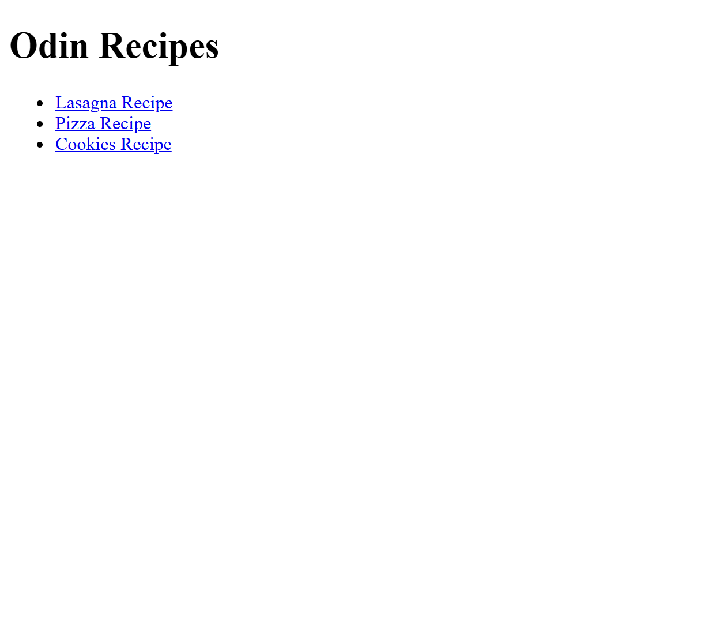
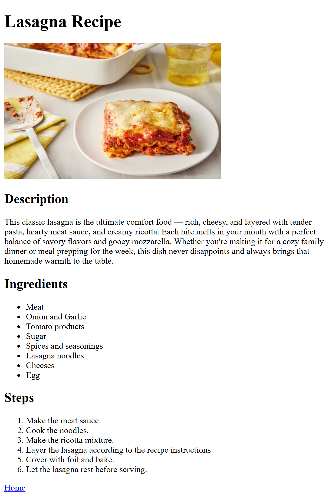

# Odin Recipes

A simple multi-page recipe website built as part of The Odin Project Foundations curriculum.

This project focuses on practicing the fundamentals of web development using HTML, including page structure, navigation, images, lists, and file organization.

---

## Preview




---

## About The Project

Odin Recipes is a beginner web development project that demonstrates the core building blocks of the web using only HTML.

The website consists of a homepage that links to multiple recipe pages. Each recipe page contains ingredients, cooking instructions, and images organized using semantic HTML elements.

The primary goal of this project was to gain hands-on experience with creating and connecting web pages while following a structured development workflow with Git and GitHub.

---

## Features

- Multi-page website structure
- Homepage with recipe navigation
- Individual recipe pages
- Recipe images
- Ingredients and instructions sections
- Organized project directory structure
- Semantic HTML

---

## Built With

- HTML5
- Git
- GitHub

---

## Project Structure

```text
odin-recipes/
│
├── index.html
│
├── recipes/
│   ├── lasagna.html
│   ├── pizza.html
│   └── salad.html
│
├── screenshots/
│   ├── homepage.png
│   └── recipe-example.png
│
└── README.md
```

---

## Getting Started

### Clone the Repository

```bash
git clone https://github.com/Mo-CodeMaster/odin-recipes.git
```

### Navigate to the Project

```bash
cd odin-recipes
```

### Run the Project

Open `index.html` in your preferred web browser.

No installation, dependencies, or build tools are required.

---

## Learning Objectives

This project was created to practice:

- Creating HTML documents from scratch
- Structuring content with semantic HTML
- Working with links and navigation
- Using images within web pages
- Organizing files and folders
- Managing source code with Git
- Hosting code on GitHub

---

## Lessons Learned

While building this project, I improved my understanding of:

- The basic structure of a website
- Relative and absolute file paths
- HTML lists, headings, paragraphs, and images
- Project organization and maintainability
- Version control fundamentals using Git

---

## Future Improvements

Potential enhancements include:

- Responsive CSS styling
- Improved visual design
- Consistent layout across pages
- Accessibility improvements
- Search functionality
- Recipe categories and filtering
- Dark mode support

---

## Screenshots

### Homepage


### Recipe Page



---

## The Odin Project

This project was completed as part of The Odin Project Foundations Course.

The Odin Project is an open-source curriculum designed to teach full-stack web development through hands-on projects and practical learning.

---

## License

This project is intended for educational purposes.

Feel free to fork, explore, and learn from the code.
